<p align="center">
  
  
  
  
  
</p>

<h1 align="center">🌟 TweetScape</h1>

<p align="center">
  <strong>A local-first intelligence platform that maps the emotional landscape of social media discourse</strong>
</p>

<p align="center">
  <em>Transform unstructured social noise into structured, actionable psychological insights</em>
</p>

---

## 📖 The Problem

Social media analysis faces a dual challenge: **Data Velocity** and **Semantic Ambiguity**.

| Problem | Traditional Approach | Reality |
|---------|---------------------|---------|
| **Shallow Analysis** | Count keywords & hashtags | Fails to capture *why* a topic is trending |
| **Binary Sentiment** | Positive vs Negative | Misses psychological nuance (Fear vs Anger vs Disgust) |
| **Data Pollution** | Manual filtering | Bots, duplicates, and sarcasm break classifiers |

## 💡 The Solution

**TweetScape** is a full-stack intelligence engine that replaces static charts with a **"Tug of War" Physics Simulation**—physically pulling conflicting opinions apart in real-time to visualize public discourse polarization.

<p align="center">
  
</p>

### Under the Hood

The system orchestrates a modular AI pipeline:
1. **Discriminative Models** (RoBERTa, UMAP) handle high-speed clustering and emotion detection
2. **Generative Agent** (Gemma 3 via Ollama) autonomously expands queries and summarizes narratives

---

## ✨ Features

### 🧠 AI-Powered Analysis
- **Query Expansion**: Gemma 3 (4B) via Ollama generates related search queries for broader coverage
- **Contextual Summarization**: LLM synthesizes cluster content into executive summaries
- **Local Inference**: Zero API costs—runs entirely on your machine

### 📊 Multi-Dimensional NLP Pipeline
- **Semantic Embeddings**: `all-MiniLM-L6-v2` for high-quality text representations
- **7-Class Emotion Detection**: Joy, Anger, Fear, Disgust, Sadness, Surprise, Neutral using `distilroberta-base`
- **Sentiment Analysis**: `twitter-roberta-base-sentiment` with continuous -1 to +1 scoring
- **Topic Extraction**: KeyBERT identifies key themes (e.g., "Pricing", "UX", "Support")
- **UMAP Projection**: Preserves global semantic structure in 2D visualization

### 🎨 Physics-Based Visualization
- **"Tug of War" Layout**: Custom D3.js force simulation
  - X-axis: Sentiment polarity (Negative ← → Positive)
  - Color: Emotional driver (7 distinct colors)
  - Glow effects for strong sentiments
- **Live Metrics**: Real-time Polarization Score (0-1), sentiment distribution

### 🛡️ Data Engineering
- **Smart Deduplication**: Removes exact and near-duplicates (normalized text matching)
- **Bot Filtering**: Surface-level spam detection
- **Transparency**: Quality metrics exposed in UI ("15% duplicates removed")

---

## 🏗️ Architecture

```mermaid
graph TD
    User["🔍 User Query"] -->|Topic| API[FastAPI Backend]
    
    subgraph Orchestration
        API -->|Expand Query| Agent["🤖 Gemma 3 Agent"]
        Agent -->|5 Related Queries| Scraper
    end
    
    subgraph Data Collection
        Scraper["🌐 Playwright Scraper"] -->|Raw Tweets| Dedup[Deduplication]
    end
    
    subgraph Intelligence Pipeline
        Dedup -->|Clean Data| Embed["📊 Sentence Transformers"]
        Embed -->|Embeddings| UMAP["UMAP Reduction"]
        Embed -->|Text| Sentiment["RoBERTa Sentiment"]
        Embed -->|Text| Emotion["RoBERTa Emotion"]
        Embed -->|Text| Topics["KeyBERT Topics"]
    end
    
    subgraph Visualization
        UMAP -->|Coordinates| React["⚛️ React Frontend"]
        Sentiment -->|Scores| React
        Emotion -->|Labels| React
        Topics -->|Keywords| React
        React -->|D3.js| Force["Force Simulation"]
    end
    
    Agent -->|Summarize| Summary["📝 AI Summary"]
    Summary --> React
```



---

## 💻 Tech Stack

### Frontend
| Technology | Purpose |
|------------|---------|
| **React 19** (Vite) | Component-based UI architecture |
| **D3.js** | Custom force simulation & physics-based visualization |
| **Framer Motion** | Smooth animations and transitions |
| **Plotly.js** | Additional chart components |

### Backend
| Technology | Purpose |
|------------|---------|
| **FastAPI** | High-performance async API framework |
| **Playwright** | Headless browser automation for Twitter scraping |
| **Pydantic** | Request/response validation |
| **Uvicorn** | ASGI production server |

### AI / ML
| Model | Purpose |
|-------|---------|
| **Ollama + Gemma 3 (4B)** | Local LLM for query expansion & summarization |
| **all-MiniLM-L6-v2** | Sentence embeddings |
| **cardiffnlp/twitter-roberta-base-sentiment** | Sentiment analysis |
| **j-hartmann/emotion-english-distilroberta-base** | 7-class emotion detection |
| **KeyBERT** | Topic/keyword extraction |
| **UMAP** | Dimensionality reduction |

---

## 🚀 Getting Started

### Prerequisites

- Python 3.10+
- Node.js 18+
- [Ollama](https://ollama.ai/) (for AI agent features)

### Installation

#### 1. Clone the repository

```bash
git clone https://github.com/SuyeshJadhav/tweetscape.git
cd tweetscape
```

#### 2. Setup Backend

```bash
cd backend

# Create virtual environment (recommended)
python -m venv venv
source venv/bin/activate  # On Windows: venv\Scripts\activate

# Install dependencies
pip install -r requirements.txt

# Install Playwright browser
playwright install chromium

# Start the server
uvicorn main:app --reload
```

#### 3. Setup Frontend

```bash
cd frontend

# Install dependencies
npm install

# Start development server
npm run dev
```

#### 4. Initialize Local AI (Optional but Recommended)

```bash
# Pull the Gemma 3 model for the agent
ollama pull gemma3:4b

# Verify Ollama is running
curl http://localhost:11434/api/tags
```

### First Run

1. Navigate to `http://localhost:3000`
2. Enter a search topic (e.g., "iPhone 16")
3. Wait for scraping + analysis pipeline
4. Explore the Tug of War visualization!

---

## 📁 Project Structure

```
tweetscape/
├── backend/
│   ├── main.py              # FastAPI app entrypoint
│   ├── config.py            # Centralized configuration
│   ├── routes/
│   │   ├── cluster.py       # /api endpoints for clustering
│   │   └── agent.py         # /agent endpoints for AI features
│   └── services/
│       ├── scraper.py       # Playwright Twitter scraper
│       ├── pipeline.py      # Main processing orchestration
│       ├── analysis.py      # Sentiment, emotion, topic extraction
│       ├── clustering.py    # UMAP, embeddings, clustering
│       ├── agent.py         # Query expansion & summarization logic
│       └── ollama_client.py # Direct Ollama HTTP client
├── frontend/
│   ├── src/
│   │   ├── App.jsx          # Main application component
│   │   ├── components/
│   │   │   ├── ClusterMap.jsx   # D3.js Tug of War visualization
│   │   │   ├── SearchBar.jsx    # Topic input
│   │   │   ├── TweetList.jsx    # Tweet display
│   │   │   └── Loading.jsx      # Loading states
│   │   └── api/
│   │       └── client.js    # Backend API client
│   └── index.html
└── data/                    # Generated tweet & cluster data
```

---

## 🔮 Roadmap

- [ ] **Pagination**: Server-side pagination for 10k+ tweet datasets
- [ ] **Time Travel**: Replay narrative evolution over days/weeks
- [ ] **Interactive RAG**: Chat with your cluster data ("What are the top 3 complaints?")
- [ ] **Export**: PDF/PNG export of visualizations
- [ ] **Docker**: Containerized deployment

---

## 🤝 Contributing

Contributions are welcome! Please see [CONTRIBUTING.md](CONTRIBUTING.md) for guidelines.

1. Fork the repository
2. Create your feature branch (`git checkout -b feature/amazing-feature`)
3. Commit your changes (`git commit -m 'Add amazing feature'`)
4. Push to the branch (`git push origin feature/amazing-feature`)
5. Open a Pull Request

---

## 📄 License

Distributed under the MIT License. See [LICENSE](LICENSE) for more information.

---

## 🙏 Acknowledgments

- [Ollama](https://ollama.ai/) for local LLM inference
- [HuggingFace](https://huggingface.co/) for pre-trained models
- [D3.js](https://d3js.org/) for visualization primitives
- [CardiffNLP](https://github.com/cardiffnlp) for Twitter-specific models

---

<p align="center">
  Made with ❤️ by <a href="https://github.com/SuyeshJadhav">Suyesh Jadhav</a>
</p>
