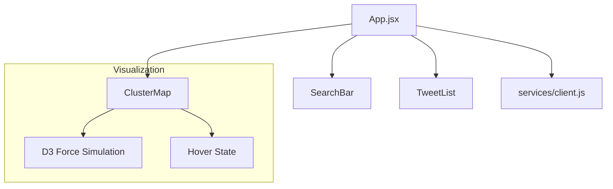

# Frontend Documentation

The TweetScape frontend is a modern **React 19** application built with **Vite**. It focuses on visualizing high-dimensional semantic data through an interactive "Tug of War" physics simulation.

## Architecture



## Core Components

### 1. `ClusterMap.jsx` (The "Tug of War")
This is the heart of the visualization. It does not use a charting library wrapper; instead, it implements a raw **D3.js Force Simulation** inside a React `useEffect` hook.

**Physics Logic:**
- **X-Axis Force:** Pulls nodes horizontally based on their `sentiment_score` (-1 to +1).
  - Negative tweets (-1) are pulled Left.
  - Positive tweets (+1) are pulled Right.
- **Y-Axis Force:** Pulls nodes gently toward the vertical center to form a "stream" or "cloud".
- **Collision Force:** Prevents nodes from overlapping.

**Visual Encoding:**
- **Position (X)**: Sentiment (Polarity).
- **Color**: Emotion (Joy=Green, Anger=Red, etc.).
- **Glow**: Indicates high intensity (>0.7 score).
- **Animation**: Continuous "floating" sine-wave animation after the physics simulation settles.

### 2. `App.jsx` (Orchestrator)
Manages the application state:
- `loading`: Boolean flag for the scraping/clustering process.
- `clusterData`: The full dataset returned by the backend.
- `error`: Error messages.

It also computes **real-time metrics** on the client side:
- **Polarization Score**: Variance of sentiment scores.
- **Sentiment Counts**: Positive/Neutral/Negative split.

### 3. `client.js` (API Layer)
A lightweight Axios wrapper located in `frontend/src/api/client.js`.
- Configured with a `baseURL` pointing to the FastAPI backend.
- Exports `clusterTopic(topic)` to handle the heavy lifting.

## Styling
- **CSS Modules/Global**: Uses `index.css` for global styles.
- **Theme**: Dark mode by default (`#0a0a0a` background).
- **Typography**: `Space Mono` for data/metrics, system fonts for UI.

## Development

**Install Dependencies:**
```bash
npm install
```

**Run Dev Server:**
```bash
npm run dev
```

**Build for Production:**
```bash
npm run build
```
